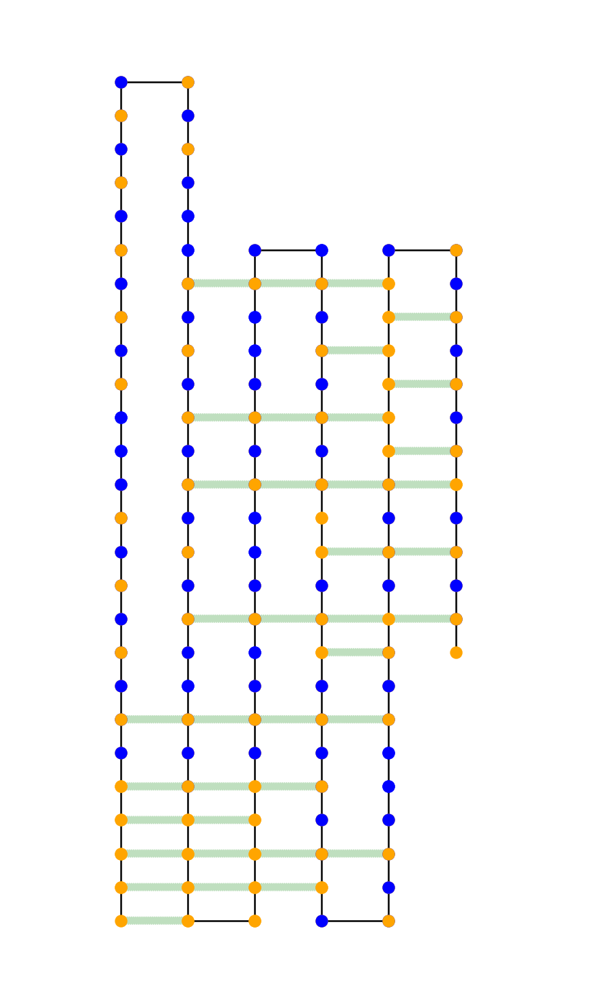

# Best Restricted Fold
`fold.py` is a program which finds the best *restricted* fold of a given polypetide in the HP-model.

## Definition
A fold is a string in the subset of `Σ*` where `Σ = { U, D, L, R }` predicated on describing a self-avoiding walk. The language is named `FOLD`.

A *restricted* fold is a fold which where `|Σ| < 4`. The language is named `ZFOLD` since the folds in this language look like zig-zags. Formally, `ZFOLD ⊆ FOLD`.

## How to Run (w/ Examples)

  * `0`s represent **hydrophilic** amino acids (`P`)
  * `1`s represent **hydrophobic** amino acids (`H`)

#### Exact Model
```bash
python3.6 fold.py exact -P 11111010101010001010101010101000101010101010010111111111101001000101000100101010111011010101101010001011010111111101010101101010
```

This finds the best restricted fold of the given polypeptide.
In this case, the polypetide length is `128` and the maximum number of connections is `38`.
Below is an image corresponding to the fold.



  * Orange -> `H`
  * Blue -> `P`
  * Green Squiggles are connections formed

#### Random Model
```bash
python3.6 fold.py random -N 128
```

This finds the restricted fold which will maximize the expectation on the number of connections given that each amino acid is equally likely to be hydrophillic or hydrophobic.
This model actually operates using a Markov distribution as represented by the matrix `M` in the code. I just have not added command-line arguments to modify the matrix.
